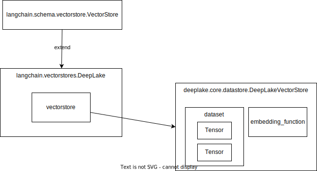

# Vectorstore

https://python.langchain.com/docs/integrations/vectorstores

## Overview



1. EmebddingしたVectorを格納するDatastore
1. LangChainのVectorStoreの中のvectorstoreに実際のvectorstoreが格納されている
1. DeepLakeなら[deeplake_vectorstore.py](https://github.com/activeloopai/deeplake/blob/main/deeplake/core/vectorstore/deeplake_vectorstore.py#L754)が本体のvectorstore.
    1. [dataset](https://github.com/activeloopai/deeplake/blob/main/deeplake/api/dataset.py)

        1. [delete_and_commit](https://github.com/activeloopai/deeplake/blob/16f051c4cedcb201bc9fdd574d73d1b628796c0e/deeplake/core/vectorstore/vector_search/dataset/dataset.py#L224)

## Types of Vector Store

1. [Qdrant](https://github.com/qdrant/qdrant-client)
1. [Deeplake](https://github.com/activeloopai/deeplake)

## Usage: Embedding -> Vector -> VectorStore (Qdrant) -> RetrievalQA

1. Qdrant のClientの初期化(local fileの場合)
    ```py
    client = QdrantClient(path=QDRANT_PATH)
    ```
    Qdrant
    ```py
    Qdrant(client=client, collection_name=COLLECTION_NAME, embeddings=OpenAIEmbeddings())
    ```
1. Qdrantに`str`または`Document`を追加
    ```py
    qdrant.add_texts(texts_or_docs)
    qdrant.add_documents(texts_or_docs)
    ```
1. Retrieverの初期化
    ```py
    retriever = qdrant.as_retriever(
        # "mmr",  "similarity_score_threshold" などもある
        search_type="similarity",
        # 文書を何個取得するか (default: 4)
        search_kwargs={"k": 5},
    )
    return RetrievalQA.from_chain_type(
        llm=llm, chain_type="stuff", retriever=retriever, return_source_documents=True, verbose=True
    )
    ```
1. Question＆Answer: 上で作成したretriverに質問する
    ```py
    qa("ウェブサイト上でユーザに問題があったケースを教えてください。")
    ```

## VectorStore (Interface for vector store)

1. [VectorStore.from_documents](https://github.com/langchain-ai/langchain/blob/5dbe456aae755e3190c46316102e772dfcb6e148/libs/langchain/langchain/schema/vectorstore.py#L428C1-L438C79)は texts と metadatasをfrom_textsに渡しているだけ:

    ```py
    @classmethod
    def from_documents(
        cls: Type[VST],
        documents: List[Document],
        embedding: Embeddings,
        **kwargs: Any,
    ) -> VST:
        """Return VectorStore initialized from documents and embeddings."""
        texts = [d.page_content for d in documents]
        metadatas = [d.metadata for d in documents]
        return cls.from_texts(texts, embedding, metadatas=metadatas, **kwargs)
    ```

1. [DeepLake.from_texts](https://github.com/langchain-ai/langchain/blob/5dbe456aae755e3190c46316102e772dfcb6e148/libs/langchain/langchain/vectorstores/deeplake.py#L730C1-L786C32)は 結局は`add_texts`をしてるだけ
    ```py
        @classmethod
        def from_texts(
            cls,
            texts: List[str],
            embedding: Optional[Embeddings] = None,
            metadatas: Optional[List[dict]] = None,
            ids: Optional[List[str]] = None,
            dataset_path: str = _LANGCHAIN_DEFAULT_DEEPLAKE_PATH,
            **kwargs: Any,
        ) -> DeepLake:
            deeplake_dataset = cls(dataset_path=dataset_path, embedding=embedding, **kwargs)
            deeplake_dataset.add_texts(
                texts=texts,
                metadatas=metadatas,
                ids=ids,
            )
            return deeplake_dataset
    ```

1. [DeepLake.add_texts](https://github.com/langchain-ai/langchain/blob/5dbe456aae755e3190c46316102e772dfcb6e148/libs/langchain/langchain/vectorstores/deeplake.py#L226C1-L234C10)は、[DeepLakeVectorStore.add](https://github.com/activeloopai/deeplake/blob/v3.8.2/deeplake/core/vectorstore/deeplake_vectorstore.py#L210) (https://github.com/activeloopai/deeplake)している (具体的にやっていることはEmbedding Function (このケースだとOpenAI)を叩いて与えられたテキストをEmbeddingしてVectorStoreに格納する)

    ```py
        return self.vectorstore.add(
            text=texts,
            metadata=metadatas,
            embedding_data=texts,
            embedding_tensor="embedding",
            embedding_function=self._embedding_function.embed_documents,  # type: ignore
            return_ids=True,
            **kwargs,
        )
    ```

## Tips

```py
vector_store = DeepLake(
    dataset_path=DATASET_PATH,
    read_only=False,
    embedding=cached_embedder,
)
```

1. datasetサマリー
    ```py
    vector_store.vectorstore.dataset.summary()
    Dataset(path='./datasets/v1', tensors=['embedding', 'id', 'metadata', 'text'])

      tensor      htype     shape    dtype  compression
      -------    -------   -------  -------  -------
     embedding  embedding   (0,)    float32   None
        id        text      (0,)      str     None
     metadata     json      (0,)      str     None
       text       text      (0,)      str     None
    ```
1. datasetをリセットする (Tensorも消えるので注意)
    ```py
    import deeplake
    deeplake.empty(vector_store.vectorstore.dataset.path, overwrite=True)
    ```

    with [delete_all_samples_if_specified](https://github.com/activeloopai/deeplake/blob/16f051c4cedcb201bc9fdd574d73d1b628796c0e/deeplake/core/vectorstore/deeplake_vectorstore.py#L595)
    ```py
    from deeplake.core.vectorstore.vector_search import dataset as dataset_utils
    dataset_utils.delete_all_samples_if_specified(vector_store.vectorstore.dataset, True)
    ```

    ```py
    from deeplake.core.vectorstore.vector_search import dataset as dataset_utils
    ```
1. datasetのtensorをClearする (`id`はTensor名)
    ```py
    vector_store.vectorstore.dataset.id.clear()
    ```
