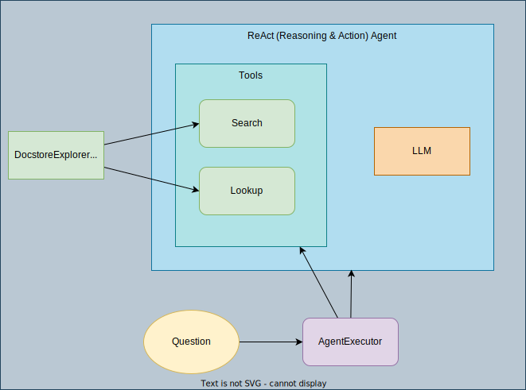
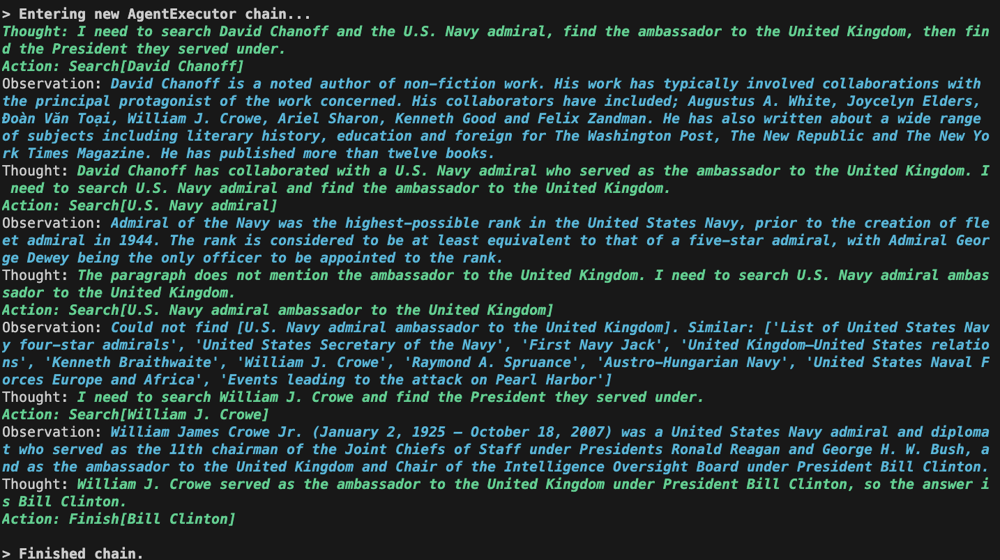
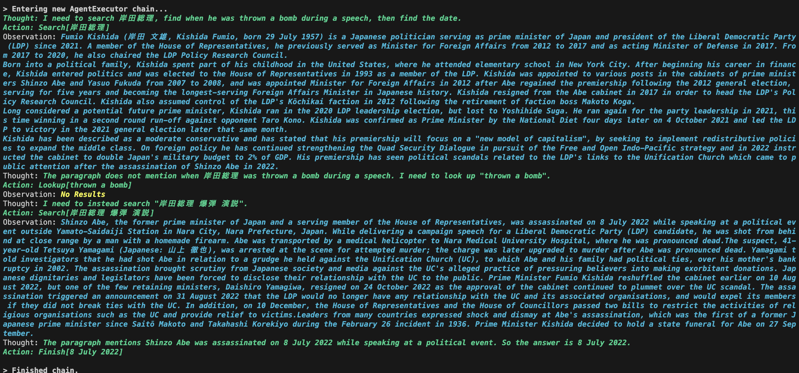

## [ReAct (Reason+Act) prompting in OpenAI GPT and LangChain](https://tsmatz.wordpress.com/2023/03/07/react-with-openai-gpt-and-langchain/)



### Run

```
poetry run python src/langchain/react_docstore.py
```

### Example: Author David Chanoff has collaborated with a U.S. Navy admiral who served as the ambassador to the United Kingdom under which President?



### Example: 岸田総理が演説中に爆弾を投げ込まれたのはいつ?



答えは間違ってしまった。

Wikipediaには、以下があるから取ってきてほしかった。

> On 15 April 2023, a man threw a cylindrical explosive at Kishida shortly before he was due to make a campaign speech in Wakayama.
