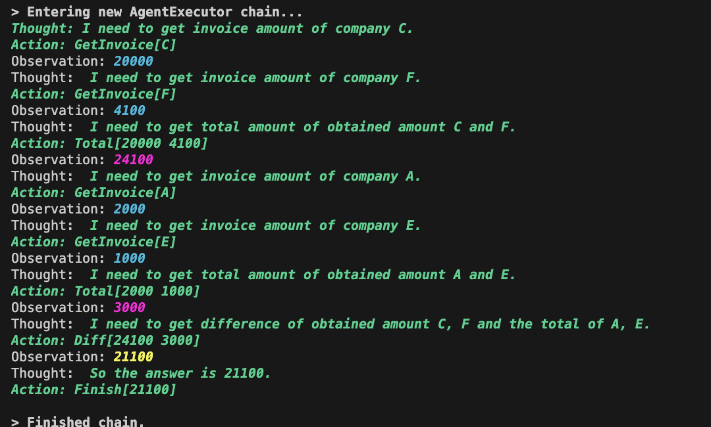

## [Custom ReAct (Reason+Act)](https://tsmatz.wordpress.com/2023/03/07/react-with-openai-gpt-and-langchain/)


1. AgentExecutorで実行開始、終了条件に達するまでLoopを回し、Loop内でAgent.planを呼ぶ。
1. Agent.planではLLMにどのActionを取るべきか聞き帰ってきたOutputをParseして、AgentFinishの場合は終わり、AgentActionの場合は、InputとともにToolを実行し、その結果を返す。
1. `Action` (Toolの中から何を使うべきかの司令), `Thought` (LLMがどのActionを取るべきか返してきたもの), `Observation` (Toolの結果), `Finish` (最終的な答え) は、PromptやExample内で使われるだけでなく、OutputParserやAgent内の`finish_tool_name`, `observation_prefix`, `llm_prefix`で定義される (日本語にすべて変えることも可能 [#19](https://github.com/nakamasato/gpt-poc/pull/19))

## 1. Run

```
poetry run python src/langchain/react_custom.py
```



1. 緑: LLMからのアウトプット
1. 黄色、ピンク：Toolの結果

## 2. Components

### 2.1. Tools

ツールリストもある: https://python.langchain.com/en/latest/modules/agents/tools/getting_started.html

**Custom Tools:**

Tool consists of several components:

1. `name (str)`, is required and must be unique within a set of tools provided to an agent
1. `description (str)`, is optional but recommended, as it is used by an agent to determine tool use
1. `return_direct (bool)`, defaults to False
1. `args_schema (Pydantic BaseModel)`, is optional but recommended, can be used to provide more information (e.g., few-shot examples) or validation for expected parameters.

**作り方1: Tool**:

1. [Tool dataclass](https://python.langchain.com/en/latest/modules/agents/tools/custom_tools.html#tool-dataclass)
    ```py
    Tool.from_function(
        func=search.run,
        name = "Search",
        description="useful for when you need to answer questions about current events"
        # coroutine= ... <- you can specify an async method if desired as well
    ),
    ```
1. [Subclassing the BaseTool class](https://python.langchain.com/en/latest/modules/agents/tools/custom_tools.html#subclassing-the-basetool-class)

    ```py
    class CustomSearchTool(BaseTool):
        name = "custom_search"
        description = "useful for when you need to answer questions about current events"

        def _run(self, query: str, run_manager: Optional[CallbackManagerForToolRun] = None) -> str:
            """Use the tool."""
            return search.run(query)

        async def _arun(self, query: str, run_manager: Optional[AsyncCallbackManagerForToolRun] = None) -> str:
            """Use the tool asynchronously."""
            raise NotImplementedError("custom_search does not support async")
    ````
1. [Using @tool decorator](https://python.langchain.com/en/latest/modules/agents/tools/custom_tools.html#using-the-tool-decorator)
    ```py
    from langchain.tools import tool

    @tool("search", return_direct=True)
    def search_api(query: str) -> str:
        """Searches the API for the query."""
        return "Results"

    search_api
    ```

**作り方2: Structured Tool**:

1. [Structured Tool](https://python.langchain.com/en/latest/modules/agents/tools/custom_tools.html#custom-structured-tools)
    ```py
    def post_message(url: str, body: dict, parameters: Optional[dict] = None) -> str:
        """Sends a POST request to the given url with the given body and parameters."""
        result = requests.post(url, json=body, params=parameters)
        return f"Status: {result.status_code} - {result.text}"

    tool = StructuredTool.from_function(post_message)
    ```
1. [Subclassing BaseTool](https://python.langchain.com/en/latest/modules/agents/tools/custom_tools.html#subclassing-the-basetool)
1. [Using decorator](https://python.langchain.com/en/latest/modules/agents/tools/custom_tools.html#using-the-decorator)


Others

1. [Priorities of tools](https://python.langchain.com/en/latest/modules/agents/tools/custom_tools.html#defining-the-priorities-among-tools)

    Descriptionに`Use this more than the normal search if the question is about Music, like 'who is the singer of yesterday?' or 'what is the most popular song in 2022?'`のように書く。Defaultではnormal toolが優先される
1. **return_direct=True**: Toolの結果がそのまま返される (LLMなしで？)

### 2.2. [Agents](https://python.langchain.com/en/latest/modules/agents/agents.html)

### 2.2.1. Agent Types

1. **zero-shot-react-description**: This agent uses the **ReAct** framework to determine which tool to use based solely on the tool’s **description**. Any number of tools can be provided. This agent requires that a description is provided for each tool.
1. **react-docstore**: This agent uses the **ReAct** framework to interact with a **docstore**. Two tools must be provided: a **Search** tool and a **Lookup** tool ([REACT: SYNERGIZING REASONING AND ACTING IN LANGUAGE MODELS](https://arxiv.org/pdf/2210.03629.pdf))
1. **self-ask-with-search**:  utilizes a single tool that should be named `Intermediate Answer`. ([MEASURING AND NARROWING
THE COMPOSITIONALITY GAP IN LANGUAGE MODELS](https://ofir.io/self-ask.pdf))
    - the term *compositionality gap* to describe the fraction of compositional questions that
the model answers incorrectly out of all the compositional questions for which the model answers the sub-questions correctly
1. **conversational-react-description**:

### 2.2.2. Agent Classes

1. [BaseSingleActionAgent](https://github.com/hwchase17/langchain/blob/1ff7c958b0a84b08c84eebba958b5b3fb0e6e409/langchain/agents/agent.py#L44): tbd
1. [LLMSingleActionAgent](https://github.com/hwchase17/langchain/blob/1ff7c958b0a84b08c84eebba958b5b3fb0e6e409/langchain/agents/agent.py#L306): BaseSingleActionAgentの拡張
1. [Agent](https://github.com/hwchase17/langchain/blob/1ff7c958b0a84b08c84eebba958b5b3fb0e6e409/langchain/agents/agent.py#L378): BaseSingleActionAgentの拡張
    1. [use output parsers in agents#2987](https://github.com/hwchase17/langchain/pull/2987)からOutputParserが導入された

Agentの以下の関数でfinish, observation, prefixの名前を指定する。

```py
    @property
    def finish_tool_name(self) -> str:
        return "Finish"

    @property
    def observation_prefix(self) -> str:
        return "Observation: "

    @property
    def llm_prefix(self) -> str:
        return "Thought: "
```

### 2.3. Toolkikt

1. [CSV Agent](https://python.langchain.com/en/latest/modules/agents/toolkits/examples/csv.html): Pandasを使ってinteractiveにCSVとやり取りできる
1. Vectorstore agent

### 2.4. [Agent Executors](https://python.langchain.com/en/latest/modules/agents/agent_executors.html)

### 2.5. [Plan and Execute](https://python.langchain.com/en/latest/modules/agents/plan_and_execute.html)

## Ref

1. [Custom Agent](https://python.langchain.com/en/latest/modules/agents/agents/custom_agent.html)
1. [ReAct with OpenAI GPT and LangChain](https://tsmatz.wordpress.com/2023/03/07/react-with-openai-gpt-and-langchain/)
1. [Custom Agent (Blog from LangChain)](https://blog.langchain.dev/custom-agents/)
1. [推論し、行動するChatGPT(OpenAI API) Agentを作る – langchain ReAct Custom Agent基礎 –](https://recruit.gmo.jp/engineer/jisedai/blog/react-custom-agent/)
1. [Change ReAct words to Japanese](https://github.com/nakamasato/gpt-poc/pull/19)
1. [Custom ReAct解剖](README_08_react_decompose.md)
