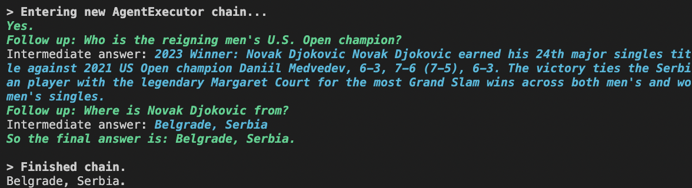

# [self ask with search](https://python.langchain.com/en/latest/modules/agents/agents/examples/self_ask_with_search.html)

## Example

```python
from langchain_community.llms import OpenAI
from langchain import SerpAPIWrapper
from langchain.agents import initialize_agent, Tool
from langchain.agents import AgentType

llm = OpenAI(temperature=0)
search = SerpAPIWrapper()
tools = [
    Tool(
        name="Intermediate Answer",
        func=search.run,
        description="useful for when you need to ask with search"
    )
]

self_ask_with_search = initialize_agent(tools, llm, agent=AgentType.SELF_ASK_WITH_SEARCH, verbose=True)
self_ask_with_search.run("What is the hometown of the reigning men's U.S. Open champion?")
```

This agent utilizes a single tool that should be named `Intermediate Answer`

## Implementation

1. [SelfAskWithSearchAgent(Agent)](https://github.com/langchain-ai/langchain/blob/d2cce54bf1930312be04405750aad40882d2353e/libs/langchain/langchain/agents/self_ask_with_search/base.py):
1. [SelfAskOutputParser](https://github.com/langchain-ai/langchain/blob/d2cce54bf1930312be04405750aad40882d2353e/libs/langchain/langchain/agents/output_parsers/self_ask.py#L9)
    1. 最終行に`Followup:`があれば、`AgentAction("Intermediate Answer", after_colon, text)`を返す
    1. ない場合には、`"So the final answer is: "`があれば、`AgentFinish({"output": last_line[len(self.finish_string) :]}, text)`を返しそれ以外は、`OutputParserException(f"Could not parse output: {text}")`
1. [prompt](https://github.com/langchain-ai/langchain/blob/d2cce54bf1930312be04405750aad40882d2353e/libs/langchain/langchain/agents/self_ask_with_search/prompt.py): few shotsのようなpromptで、Exampleをいくつか載せて `Follow up: <toolに聞く質問>` を返すようにしてもらっている。特に不要であれば、 `So the final answer is: <最終的な回答>`を返すようにしてもらっている。
    ```
    Question: Who lived longer, Muhammad Ali or Alan Turing?
    Are follow up questions needed here: Yes.
    Follow up: How old was Muhammad Ali when he died?
    Intermediate answer: Muhammad Ali was 74 years old when he died.
    Follow up: How old was Alan Turing when he died?
    Intermediate answer: Alan Turing was 41 years old when he died.
    So the final answer is: Muhammad Ali

    Question: When was the founder of craigslist born?
    Are follow up questions needed here: Yes.
    Follow up: Who was the founder of craigslist?
    Intermediate answer: Craigslist was founded by Craig Newmark.
    Follow up: When was Craig Newmark born?
    Intermediate answer: Craig Newmark was born on December 6, 1952.
    So the final answer is: December 6, 1952

    Question: Who was the maternal grandfather of George Washington?
    Are follow up questions needed here: Yes.
    Follow up: Who was the mother of George Washington?
    Intermediate answer: The mother of George Washington was Mary Ball Washington.
    Follow up: Who was the father of Mary Ball Washington?
    Intermediate answer: The father of Mary Ball Washington was Joseph Ball.
    So the final answer is: Joseph Ball

    Question: Are both the directors of Jaws and Casino Royale from the same country?
    Are follow up questions needed here: Yes.
    Follow up: Who is the director of Jaws?
    Intermediate answer: The director of Jaws is Steven Spielberg.
    Follow up: Where is Steven Spielberg from?
    Intermediate answer: The United States.
    Follow up: Who is the director of Casino Royale?
    Intermediate answer: The director of Casino Royale is Martin Campbell.
    Follow up: Where is Martin Campbell from?
    Intermediate answer: New Zealand.
    So the final answer is: No

    Question: {input}
    Are followup questions needed here:{agent_scratchpad}
    ```


## Search tools

### SerpAPIWrapper ✅

Need to get api key from https://serpapi.com/manage-api-key and set it to `SERPAPI_API_KEY` environment variable.

```
poetry run python src/langchain/self_ask_with_search.py --search-tool SerpAPIWrapper
```



### DuckDuckGoSearchRun ❌


```
poetry run python src/langchain/self_ask_with_search.py --search-tool DuckDuckGoSearchRun
```

Error

```
s/agent.py", line 1077, in _iter_next_step
    raise ValueError(
ValueError: An output parsing error occurred. In order to pass this error back to the agent and have it try again, pass `handle_parsing_errors=True` to the AgentExecutor. This is the error: Could not parse output: No.
```
