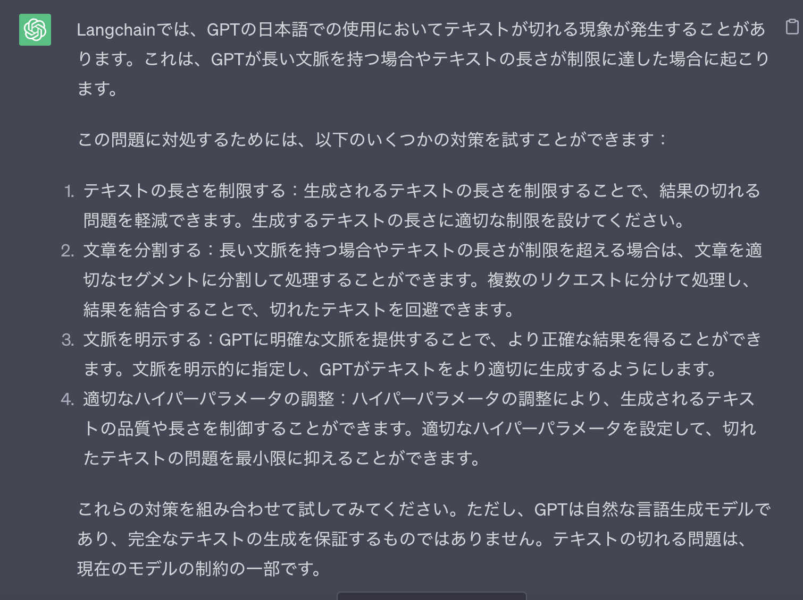

# Summarize

## 1. Chain Types

1. `stuff`: すべてのDocumentをcombineしてLLMに送る
1. `map_reduce`: それぞれの要約をつくってからまとめる
1. `refine`:最初にようやくを作り、次のDocと合わせてようやくを作っていく (Incremental)

## 2. Implementaion

1. [load_summarize_chain](https://github.com/hwchase17/langchain/blob/28d2b213a44a5f497325fcbb42973aa43dbf6e9e/langchain/chains/summarize/__init__.py#L118): llmとChain Typeを指定してchainを返す。

    引数:
    1. `llm`:
    1. `chain_type`: `stuff`がデフォルト
    1. `verbose`: bool
    1. `**kwargs`:

    返り値: `BaseCombineDocumentsChain`


    内部では、chain_typeによってそれぞれ対象となるChainをLoadしている

    ```py
    loader_mapping: Mapping[str, LoadingCallable] = {
        "stuff": _load_stuff_chain,
        "map_reduce": _load_map_reduce_chain,
        "refine": _load_refine_chain,
    }
    ```
    それぞれは、それぞれのChainを初期化する。
    1. [_load_stuff_chain](https://github.com/hwchase17/langchain/blob/28d2b213a44a5f497325fcbb42973aa43dbf6e9e/langchain/chains/summarize/__init__.py#L24C5-L24C22): デフォルトで`stuff_prompt.PROMPT`指定される。自分で指定したい場合には、`load_summarize_chain`に引数で`prompt`を指定すれば良い。prompt内のvariableも`document_variable_name`で指定することができる
        ```py
        def _load_stuff_chain(
            llm: BaseLanguageModel,
            prompt: BasePromptTemplate = stuff_prompt.PROMPT,
            document_variable_name: str = "text",
            verbose: Optional[bool] = None,
            **kwargs: Any,
        ) -> StuffDocumentsChain:
            llm_chain = LLMChain(llm=llm, prompt=prompt, verbose=verbose)
            # TODO: document prompt
            return StuffDocumentsChain(
                llm_chain=llm_chain,
                document_variable_name=document_variable_name,
                verbose=verbose,
                **kwargs,
            )
        ```
    1. [_load_map_reduce_chain](https://github.com/hwchase17/langchain/blob/28d2b213a44a5f497325fcbb42973aa43dbf6e9e/langchain/chains/summarize/__init__.py#L41C5-L41C27): デフォルトでは`map_reduce_prompt.PROMPT`が`map_prompt`と`combine_prompt`に指定されるが、自分でそれぞれ指定することができる。また、variableも`combine_document_variable_name`と`map_reduce_document_variable_name`で指定することができる。
        ```py
        def _load_map_reduce_chain(
            llm: BaseLanguageModel,
            map_prompt: BasePromptTemplate = map_reduce_prompt.PROMPT,
            combine_prompt: BasePromptTemplate = map_reduce_prompt.PROMPT,
            combine_document_variable_name: str = "text",
            map_reduce_document_variable_name: str = "text",
            collapse_prompt: Optional[BasePromptTemplate] = None,
            reduce_llm: Optional[BaseLanguageModel] = None,
            collapse_llm: Optional[BaseLanguageModel] = None,
            verbose: Optional[bool] = None,
            token_max: int = 3000,
            **kwargs: Any,
        ) -> MapReduceDocumentsChain:
            map_chain = LLMChain(llm=llm, prompt=map_prompt, verbose=verbose)
            _reduce_llm = reduce_llm or llm
            reduce_chain = LLMChain(llm=_reduce_llm, prompt=combine_prompt, verbose=verbose)
            ...
        ```
    1. [_load_refine_chain](https://github.com/hwchase17/langchain/blob/28d2b213a44a5f497325fcbb42973aa43dbf6e9e/langchain/chains/summarize/__init__.py#L95): デフォルトでは、`question_prompt`には、`refine_prompts.REFINE_PROMPT`が、`refine_prompt`には、`refine_prompts.REFINE_PROMPT`が指定されるが自分で指定することができる。variableも`document_variable_name`で指定することができる。
        ```py
        def _load_refine_chain(
            llm: BaseLanguageModel,
            question_prompt: BasePromptTemplate = refine_prompts.PROMPT,
            refine_prompt: BasePromptTemplate = refine_prompts.REFINE_PROMPT,
            document_variable_name: str = "text",
            initial_response_name: str = "existing_answer",
            refine_llm: Optional[BaseLanguageModel] = None,
            verbose: Optional[bool] = None,
            **kwargs: Any,
        ) -> RefineDocumentsChain:
            initial_chain = LLMChain(llm=llm, prompt=question_prompt, verbose=verbose)
            _refine_llm = refine_llm or llm
            refine_chain = LLMChain(llm=_refine_llm, prompt=refine_prompt, verbose=verbose)
            return RefineDocumentsChain(
                initial_llm_chain=initial_chain,
                refine_llm_chain=refine_chain,
                document_variable_name=document_variable_name,
                initial_response_name=initial_response_name,
                verbose=verbose,
                **kwargs,
            )
        ```
1. [BaseCombineDocumentsChain](https://github.com/hwchase17/langchain/blob/28d2b213a44a5f497325fcbb42973aa43dbf6e9e/langchain/chains/combine_documents/base.py#L17C7-L17C32): Stuff, MapReduce, Refine Documents ChainはすべてBaseCombineDocumentsChainを実装している
    1. `combine_docs`: Documentsを一つのstringに変換する
    1. `prompt_length`: 与えられたDocumentsに対してのPromptの長さを返す

1. [StuffDocumentsChain](https://github.com/hwchase17/langchain/blob/28d2b213a44a5f497325fcbb42973aa43dbf6e9e/langchain/chains/combine_documents/stuff.py#L21):
    [combine_docs](https://github.com/hwchase17/langchain/blob/28d2b213a44a5f497325fcbb42973aa43dbf6e9e/langchain/chains/combine_documents/stuff.py#L149C9-L149C21): function to stuff all documents into one prompt and pass to LLM.

    prompt:

    ```py
    """Write a concise summary of the following:


    "{text}"


    CONCISE SUMMARY:"""
    ```

1. `MapReduceDocumentsChain`:
    prompt
    ```py
    """Write a concise summary of the following:


    "{text}"


    CONCISE SUMMARY:"""
    ```
1. `RefineDocumentsChain`:
    init prompt:
    ```py
    """Write a concise summary of the following:


    "{text}"


    CONCISE SUMMARY:"""
    ```
    refine prompt:
    ```py
    "Your job is to produce a final summary\n"
    "We have provided an existing summary up to a certain point: {existing_answer}\n"
    "We have the opportunity to refine the existing summary"
    "(only if needed) with some more context below.\n"
    "------------\n"
    "{text}\n"
    "------------\n"
    "Given the new context, refine the original summary"
    "If the context isn't useful, return the original summary."
    ```

## Basic Usage

1. Import
    ```py
    from langchain import OpenAI, PromptTemplate, LLMChain
    from langchain.text_splitter import CharacterTextSplitter
    from langchain.chains.mapreduce import MapReduceChain
    from langchain.prompts import PromptTemplate

    llm = OpenAI(temperature=0)
    ```

1. docの準備 ([state_of_the_union.txt](../../data/state_of_the_union.txt) (723行))
    ```py
    text_splitter = CharacterTextSplitter()

    with open("../../state_of_the_union.txt") as f:
        state_of_the_union = f.read()
    texts = text_splitter.split_text(state_of_the_union)

    from langchain.docstore.document import Document

    docs = [Document(page_content=t) for t in texts[:3]]
    ```

1. Summarize

    ```py
    from langchain.chains.summarize import load_summarize_chain

    chain = load_summarize_chain(llm, chain_type="map_reduce")
    chain.run(docs)
    ```
1. 結果
    `In response to Russian aggression in Ukraine, the US and its allies are taking action to hold Putin accountable, including economic sanctions, cutting off access to technology, and a dedicated task force to go after the crimes of Russian oligarchs. The US is also providing economic and military assistance to Ukraine and mobilizing ground forces, air squadrons, and ship deployments to protect NATO countries. President Biden's American Rescue Plan and Bipartisan Infrastructure Law have provided economic relief and created jobs for millions of Americans.`

## Advanced
### Tip1: Prompt

`{text}`が必要になる

```py
prompt_template = """Write a concise summary of the following:


{text}


CONCISE SUMMARY IN JAPANESE:"""
PROMPT = PromptTemplate(template=prompt_template, input_variables=["text"])
chain = load_summarize_chain(llm, chain_type="stuff", prompt=PROMPT)
chain.run(docs)
```

```
{
    'intermediate_steps':
        [
            '\n今夜、私たちはアメリカ人として一緒に集まりました。ロシアのプーチンがウクライナに侵攻しようとしたとき、ウクライナの人々は勇敢に立ち向かいました。NATO加盟国はロシアを制裁し、犯罪を追求しています。プーチンは今よりもっと孤立しています。私たちはプーチンの豊かな資産を取り上げるために準備しています。',
            '\nアメリカはヨーロッパの仲間と共に、ロシアの豪華なヨット、アパート、プライベートジェットを押収するために取り組んでいます。空港を閉鎖し、ロシアの経済を押しつぶすために、米国は仲間と共に、ウクライナに軍事支援、経済支援、人道支援を提供しています。米国はウクライナに10億ドル以上の支援を行っています。米国はNATO加盟国を守るために、地上部隊、航空部隊',
            '\n\nアメリカは2年間で最も厳しい時期を迎えました。パンデミックは厳しく、多くの家族が食料、ガソリン、住宅などの費用を支払うのに苦労しています。私は理解しています。私は父がスコートン、ペンシルベニアから仕事を探すために家を出たのを覚えています。私が大統領になった最初のことの1つは、アメリカ救済計画を通すために戦うことでした。この計画は、国民を救済し、COVID-19と戦うために'
        ],
    'output_text': '\n\nアメリカはNATO加盟国を守るために、ウクライナへの軍事支援、経済支援、人道支援を行い、プーチンの豊かな資産を取り上げる準備をしています。また、パンデミックにより多くの家族が苦労していることを理解し、国民を救済するために戦っています。'
}
```

## 課題
- [ ] 日本語が切れてしまう
    

## Ref

1. [LangChainのSummarizationについて調べたまとめ](https://www.mattari-benkyo-note.com/2023/04/21/langchain_summarization/)
