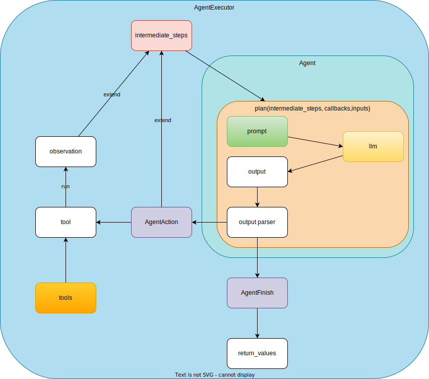

# Decompose ReAct

## 1. Overview



[Custom ReAct](03_react_custom.md)をベースにReActの内部で起こっている部分をすべて一つずつ分解して見る。

含まれる内容

1. LLMに送られるPrompt (Prompt Template): Agentにセットされている
1. LLMから帰ってきたOutput: Agent内
1. `Output Parser`: Agent内
1. `AgentAction`と`AgentFinish`: Agent.planの結果がAgentActionかAgentFinishでAgentFinishの場合にはAgentExecutor内のWhileを抜けて終了する

詳細:

1. AgentExecutorはagentとtoolsで初期化される
1. `agent_executor(inputs=question, return_only_outputs=False, callbacks=None)` で実行されるが、 `AgentExecutor`は`Chain`を継承しているので `Chain.__call__`が呼ばれる事となる。
1. `Chain.__call__`の内部からは、[AgentExecutor._call](https://www.notion.so/AgentExecutor-e41aa3019b87492ab86b4cd8530e4b31?pvs=4#272f3d65e162443280be761f05b3db16)が呼ばれる
1. `AgentExecutor._call`内ではwhileによって終了条件or `_take_next_step`の結果が`AgentFinish`になるまで`_take_next_step`を行う
1. `_take_next_step`内では、`agent_action = agent.plan(intermediate_steps, callbacks, inputs)`を実行
    1. `agent_action` が`AgentAction`の場合は、対応するツールを呼んで結果を得る `observation = tool.run()`をとり、 `result.append((agent_action, observation))`としてresultを返す (基本len(result)は1)
    1. `agent_action`が`AgentFinish`の場合は `agent_action`をそのまま帰す
1. `_take_next_step`の結果を取り
    1. AgentFinishの場合はそのままreturnして終了 (return_valuesにintermediate_stepsを入れて返す)
    1. AgentActionの場合は、intermediate_stepsに`intermediate_steps.extend(result)` 前回のresultを追加して、whileループを続ける


## 2. Implementation

### [_take_next_step](https://github.com/hwchase17/langchain/blob/e494b0a09fe6dfd0e568c8bb9f3ed9849fddb09a/langchain/agents/agent.py#L987C37-L987C52) Stepの中身

```py
output = self.agent.plan(
    intermediate_steps,
    callbacks=run_manager.get_child() if run_manager else None,
    **inputs,
)
```

1. `intermediate_steps`: agent.plan内で実行したAgentActionとResultの履歴(tuple)のlist ([intermediate_steps](https://python.langchain.com/docs/modules/agents/how_to/intermediate_steps))
1. `run_manager` <- callbackManager.on_chain_startの返り値 (特に不要であればNoneでいい)
1. `inputs`は [Chain.__call__](https://github.com/hwchase17/langchain/blob/e494b0a09fe6dfd0e568c8bb9f3ed9849fddb09a/langchain/chains/base.py#L126)のなかの[inputs = self.prep_inputs(inputs)](https://github.com/hwchase17/langchain/blob/e494b0a09fe6dfd0e568c8bb9f3ed9849fddb09a/langchain/chains/base.py#L149C23-L149C34)で変換されている

### 2.1. run_managerの出処CallbackManagerに関して

[CallbackManager.configure](https://github.com/hwchase17/langchain/blob/e494b0a09fe6dfd0e568c8bb9f3ed9849fddb09a/langchain/callbacks/manager.py#L1081):

`AgentExecutor(Chain).callbacks` は`from_agent_and_tools`で作成するとNone ([ref](https://www.notion.so/AgentExecutor-e41aa3019b87492ab86b4cd8530e4b31?pvs=4#6959e7e041cc4166b31591a5476dbf75))

```py
callback_manager = CallbackManager.configure(
    inheritable_callbacks=None, local_callbacks=None, verbose=True, inheritable_tags=None, local_tags=None
)
run_manager = callback_manager.on_chain_start( # _callにrun_managerがあるのでrun_managerを設定する
    dumpd(self), # dumpd(obj: Any) = json.loads(dumps(obj))
    inputs, # self.prep_inputsでDictになったもの
)
```

### 2.2. intermediate_stepsに関して

1. 最初の状態は `[]` ([_call()内](https://github.com/hwchase17/langchain/blob/e494b0a09fe6dfd0e568c8bb9f3ed9849fddb09a/langchain/agents/agent.py#L980))
    ```py
    intermediate_steps: List[Tuple[AgentAction, str]] = []
    ```
1. 毎回agent.planでどのツールを使うか決め、Toolを実行した後に `result.append((agent_action, observation))`がextendされる

### 2.3. inputs & input_keys

1. `Chain.__call__`内でinputsは変形されているので注意

    ```py
    inputs = {list(_input_keys)[0]: inputs}
    ```
1. `_input_keys`は各 `self.agent.input_keys` ([AgentExecutor.input_keys](https://github.com/hwchase17/langchain/blob/b95002289409077965d99636b15a45300d9c0b9d/langchain/agents/agent.py#L687-L692))
1. 今回のAgentの input_keysは
    ```
    agent.input_keys
    ['input']
    ```

### 2.4. callbacks

```py
agent_executor = AgentExecutor.from_agent_and_tools(
    agent=agent,
    tools=tools,
    callback_manager=None, # default: None (explicitly write None)
    verbose=True,
)
```

以下の定義より`cls(agent=agent, tools=tools, callback_manager=callback_manager, **kwargs)` AgentExecutorを初期化する。

```py
class AgentExecutor(Chain):
    ...
    @classmethod
    def from_agent_and_tools(
        cls,
        agent: Union[BaseSingleActionAgent, BaseMultiActionAgent],
        tools: Sequence[BaseTool],
        callback_manager: Optional[BaseCallbackManager] = None,
        **kwargs: Any,
    ) -> AgentExecutor:
        """Create from agent and tools."""
        return cls(
            agent=agent, tools=tools, callback_manager=callback_manager, **kwargs
        )
```


1. `callback_manager`は`None`で、`verbose`が`True`.
1. CallbackManagerを初期化してからrun_managerを取り出すがcallback manager自体は特に使われていない。
1. `Chain.__call__`内で run_managerがcallback_manager.on_chain_start()で取り出され、`self._call(inputs, run_manager=run_manager)`で渡される


## 3. Tips

### 3.1. 準備

```
poetry run python
```

```py
from src.langchain.react_decompose import *
```

### 3.2. 全部を実行
```py
llm = OpenAI()
agent = ReActTestAgent.from_llm_and_tools(
    llm,
    tools,
)
agent_executor = AgentExecutor.from_agent_and_tools(
    agent=agent,
    tools=tools,
    callback_manager=None, # default: None (explicitly write None)
    verbose=True,
)
question = "How much is the difference between the total of company C, F and the total of company A, E ?"
agent_executor(inputs=question, return_only_outputs=False, callbacks=None)
```

### 3.3. Agent.planのStepを1つ実行 (_take_next_step前半)

1. 実際の実行では、AgentExecutor._take_next_stepの中のループで行われている
1. OutputParserがParseに失敗することもある
1. 返り値は、 `AgentAction` or `AgentFinish`

```py
intermediate_steps = []
agent_action = agent.plan(intermediate_steps, callbacks=None, **{"input":"How much is the difference between the total of company C, F and the total of company A, E ?"})
AgentAction(tool='GetInvoice', tool_input='C', log='思考: I need to get invoice amount of company C.\n行動: GetInvoice[C]')
```

`AgentAction`には`tool`, `tool_input`, `log`がある

### 3.4. Agent.plan結果からToolを呼ぶ (_take_next_step後半)

上のagent.planの結果が`AgentAction`だった場合、`_take_next_step`の結果を以下のように取れる


```python
name_to_tool_map = {tool.name: tool for tool in tools} # https://github.com/hwchase17/langchain/blob/b95002289409077965d99636b15a45300d9c0b9d/langchain/agents/agent.py#L939C9-L939C25
agent_action # AgentAction(tool='GetInvoice', tool_input='C', log='思考: I need to get invoice amount of company C.\n行動: GetInvoice[C]')
result = []
tool = name_to_tool_map[agent_action.tool]
return_direct = tool.return_direct # false
tool_run_kwargs = agent.tool_run_logging_kwargs() # {'llm_prefix': '思考: ', 'observation_prefix': '観察: '}
if return_direct:
    tool_run_kwargs["llm_prefix"] = ""
observation = tool.run(
    agent_action.tool_input,
    verbose=True,
    callbacks=None,
    **tool_run_kwargs,
) # observation = 20000 <- toolから返された結果
result.append((agent_action, observation))
result # _take_next_stepで返される結果 [(AgentAction(tool='GetInvoice', tool_input='C', log='思考: I need to get invoice amount of company C.\n行動: GetInvoice[C]'), 20000)]
```

### 3.5. [AgentExecutor._callのwhile](https://github.com/hwchase17/langchain/blob/b95002289409077965d99636b15a45300d9c0b9d/langchain/agents/agent.py#L950)内で_take_next_stepの結果を受け取った後

```python
next_step_output = self._take_next_step(...)
```

next_step_outputにより
- AgentFinish -> _returnを呼んで終了
- その他→続行

```py
intermediate_steps.extend(result) # resultは前のステップでのresult
```

前回とほぼ同様に `intermediate_steps`だけが変わった状態でもう一度agent.planを呼ぶ

```py
agent_action = agent.plan(intermediate_steps, callbacks=None, **{"input":"How much is the difference between the total of company C, F and the total of company A, E ?"})
agent_action # AgentAction(tool='GetInvoice', tool_input='F', log=' I need to get invoice amount of company F.\n行動: GetInvoice[F]')
```

agent_actionの処理を3.4.と同様にするとresultはいかのようになる

```py
result
[(AgentAction(tool='GetInvoice', tool_input='F', log=' I need to get invoice amount of company F.\n行動: GetInvoice[F]'), 20000), (AgentAction(tool='GetInvoice', tool_input='F', log=' I need to get invoice amount of company F.\n行動: GetInvoice[F]'), 4100)]
```

そしてintermediate_stepsを更新する

```py
intermediate_steps.extend(result) # resultは前のステップでのresult
```

さらにagent.plan(intermediate_steps, callbacks, inputs) -> agent_action or agent_finish -> tool.run -> observation -> resultにappend -> intermediate_steps更新 -> …を繰り返す

結局一番大事なのは`intermediate_steps`に結果を貯めていくこと

### 3.6. AgentFinishとなった場合

`_return`でreturn_valuesを返す

[AgentExecutor._return](https://github.com/hwchase17/langchain/blob/b95002289409077965d99636b15a45300d9c0b9d/langchain/agents/agent.py#L720C1-L731C28)

```py
def _return(
    self,
    output: AgentFinish,
    intermediate_steps: list,
    run_manager: Optional[CallbackManagerForChainRun] = None,
) -> Dict[str, Any]:
    if run_manager:
        run_manager.on_agent_finish(output, color="green", verbose=self.verbose)
    final_output = output.return_values
    if self.return_intermediate_steps:
        final_output["intermediate_steps"] = intermediate_steps
    return final_output
```

## 4. Run

```
poetry run python src/langchain/react_decompose.py
```
