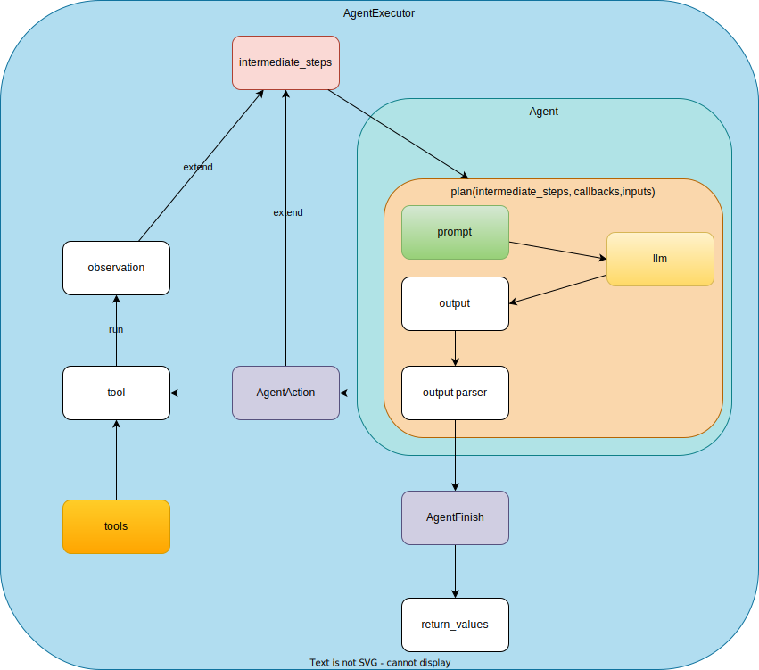

# Agent (Old)

!!! warning
    Please check [Agent](index.md) for the latest information.

## Overview

1. `Agent`は基本`AgentExecutor`から実行される
1. `Agent`には`Tools`, `llm`, `prompt`, `parser`で構成される。`initialize_agent`で初期化する場合には、AgentTypeを指定することでpromptとparserはDefaultのものを使うことができる
1. `Prompt`は、`initialize_agent`で初期化する場合には、`AgentType`によってDefault Promptが異なっているが、自分で指定することも可能。 例. `SelfAskWithSearch`では、LLMに`Follow up: <toolに聞く質問>`を返してもらい、`The final answer is <最終的な回答>`を返してもらうようにしている
1. `Tools`はどのように呼ばれるか
1. `OutputParser`は、Promptに対応するもので、llmから返ってきたOutputをParseするもの。 例. `SelfAskWithSearch`では、返ってきたoutputの最終行に`Follow up:`があれば、`AgentAction`を返し、 `The final answer is`があれば、 `AgentFinish`を返し、それ以外は、`OutputParserException`を返すようにしている。



## Implementation (Old)

!!! warning
    Please check [Agent](index.md) for the latest information.

### [AgentExecutor](https://github.com/langchain-ai/langchain/blob/a2d30428237695f076060dec881bae0258123775/libs/langchain/langchain/agents/agent.py#L820)

一つのAgentと複数のToolsをもつ

実行されるときは、初期化された`agent_executor("Jiraからパフォーマンステストに関するチケットを取得してください。")` という形で呼ばれ、`AgentExecutor`の継承元の[Chain.\_\_call\_\_()](https://github.com/langchain-ai/langchain/blob/a2d30428237695f076060dec881bae0258123775/libs/langchain/langchain/chains/base.py#L252-L287) が呼ばれ、[AgentExecutor._call](https://github.com/langchain-ai/langchain/blob/a2d30428237695f076060dec881bae0258123775/libs/langchain/langchain/agents/agent.py#L1293-L1338)がその中で呼ばれる。そして、この中で`Agent`の`plan`を呼ぶ。

`Chain.__call__`:

```py
    def __call__(
        self,
        inputs: Union[Dict[str, Any], Any],
        return_only_outputs: bool = False,
        callbacks: Callbacks = None,
        *,
        tags: Optional[List[str]] = None,
        metadata: Optional[Dict[str, Any]] = None,
        run_name: Optional[str] = None,
        include_run_info: bool = False,
    ) -> Dict[str, Any]:
        """Execute the chain.

        Args:
            inputs: Dictionary of inputs, or single input if chain expects
                only one param. Should contain all inputs specified in
                `Chain.input_keys` except for inputs that will be set by the chain's
                memory.
            return_only_outputs: Whether to return only outputs in the
                response. If True, only new keys generated by this chain will be
                returned. If False, both input keys and new keys generated by this
                chain will be returned. Defaults to False.
            callbacks: Callbacks to use for this chain run. These will be called in
                addition to callbacks passed to the chain during construction, but only
                these runtime callbacks will propagate to calls to other objects.
            tags: List of string tags to pass to all callbacks. These will be passed in
                addition to tags passed to the chain during construction, but only
                these runtime tags will propagate to calls to other objects.
            metadata: Optional metadata associated with the chain. Defaults to None
            include_run_info: Whether to include run info in the response. Defaults
                to False.

        Returns:
            A dict of named outputs. Should contain all outputs specified in
                `Chain.output_keys`.
        """
```

As you can see ***inputs: Dictionary of inputs, or single input if chain expects only one param. Should contain all inputs specified in `Chain.input_keys` except for inputs that will be set by the chain's memory***.
`Chain.input_keys`は `AgentExecutor`の[input_keys](https://github.com/langchain-ai/langchain/blob/a2d30428237695f076060dec881bae0258123775/libs/langchain/langchain/agents/agent.py#L956-L962)を参照している。

```py
    @property
    def input_keys(self) -> List[str]:
        """Get the input keys for this chain."""
        return self.agent.input_keys
```

`AgentExecutor._call`:

`_call` -> `self._take_next_step` -> `self._iter_next_step` -> `self.agent.plan(intermediate_steps, callbacks, **inputs)`と呼ぶ

```py
# Call the LLM to see what to do.
output = self.agent.plan(
    intermediate_steps,
    callbacks=run_manager.get_child() if run_manager else None,
    **inputs,
)
```

`inputs: Dict[str, str]`はDict。

### Plan

上記のAgentは`Agent`または`BaseSingleActionAgent`を継承している

1. [Agent.plan](https://github.com/langchain-ai/langchain/blob/0d0901ea18cc8ae431da3ec7b11da56c9b5568fc/libs/langchain/langchain/agents/agent.py#L617-L636):

    ```py
    full_inputs = self.get_full_inputs(intermediate_steps, **kwargs)
    full_output = self.llm_chain.predict(callbacks=callbacks, **full_inputs)
    return self.output_parser.parse(full_output)
    ```

### [initialize_agent](https://github.com/langchain-ai/langchain/blob/0bdb4343838c4513d15cd9702868adf6f652421c/libs/langchain/langchain/agents/initialize.py#L13)

agentにAgentType (e.g.`AgentType.ZERO_SHOT_REACT_DESCRIPTION`(=`zero-shot-react-description`))を指定してAgentを作成

返り値は`AgentExecutor`

使い方:

`agent`または`agent_path`を指定して作成

```py
agent_executor = initialize_agent(
    tools,
    llm,
    agent=AgentType.ZERO_SHOT_REACT_DESCRIPTION,
    verbose=True
)
```

実装:

1. Agent Classを取得
    ```py
    agent_cls = AGENT_TO_CLASS[agent]
    ```
1. AgentのObjectを各Agentの`from_llm_and_tools`メソッドを使って生成
    1. `agent`の場合: `AgentClass.from_llm_and_tools`
        ```py
        agent_obj = agent_cls.from_llm_and_tools(
            llm, tools, callback_manager=callback_manager, **agent_kwargs
        )
        ```
        Agentごとに定義されていて、この中でpromptも設定される (例. [OpenAIFunctionsAgent.from_llm_and_tools](https://github.com/langchain-ai/langchain/blob/0bdb4343838c4513d15cd9702868adf6f652421c/libs/langchain/langchain/agents/openai_functions_agent/base.py#L212C1-L237))
    1. `agent_path`の場合: `load_agent()`
        ```py
        agent_obj = load_agent(
            agent_path, llm=llm, tools=tools, callback_manager=callback_manager
        )
        ```
1. AgentExecutorの生成とReturn
    ```py
    AgentExecutor.from_agent_and_tools(
        agent=agent_obj,
        tools=tools,
        callback_manager=callback_manager,
        tags=tags_,
        **kwargs,
    )
    ```

### OutputParser

[output_parser](../06_output_parser.md)

## Agent Types (Old)

!!! warning
    Please check [Agent](index.md) for the latest information.

|Agent Type| Plan |Prompt |OutputParser | Link|
|---|---|---|---|---|
[ZeroShotAgent(Agent)](https://github.com/hwchase17/langchain/blob/b0859c9b185fe897f3c8e2699835a669b2a2ba61/langchain/agents/mrkl/base.py#L35)| `Agent(BaseSingleActionAgent)`のplanを参照| | |
|[ReActDocstoreAgent(Agent)](https://github.com/hwchase17/langchain/blob/b0859c9b185fe897f3c8e2699835a669b2a2ba61/langchain/agents/react/base.py#L20)| `Agent(BaseSingleActionAgent)`のplanを参照 | | | [React Docstore](02_react_docstore.md)|
|[SelfAskWithSearchAgent(Agent)](https://github.com/hwchase17/langchain/blob/b0859c9b185fe897f3c8e2699835a669b2a2ba61/langchain/agents/self_ask_with_search/base.py#L19)| `Agent(BaseSingleActionAgent)`のplanを参照| || [Self Ask with Search](04_self_ask_with_search.md)|
|[ConversationalAgent(Agent)](https://github.com/hwchase17/langchain/blob/b0859c9b185fe897f3c8e2699835a669b2a2ba61/langchain/agents/conversational/base.py#L20)| `Agent(BaseSingleActionAgent)`のplanを参照|||
|[ChatAgent(Agent)](https://github.com/hwchase17/langchain/blob/b0859c9b185fe897f3c8e2699835a669b2a2ba61/langchain/agents/chat/base.py#L27)| `Agent(BaseSingleActionAgent)`のplanを参照|||
|[ConversationalChatAgent(Agent)](https://github.com/hwchase17/langchain/blob/b0859c9b185fe897f3c8e2699835a669b2a2ba61/langchain/agents/conversational_chat/base.py#L36)| `Agent(BaseSingleActionAgent)`のplanを参照|||
|[StructuredChatAgent(Agent)](https://github.com/hwchase17/langchain/blob/b0859c9b185fe897f3c8e2699835a669b2a2ba61/langchain/agents/structured_chat/base.py#L26)| `Agent(BaseSingleActionAgent)`のplanを参照|
|[OpenAIFunctionsAgent(BaseSingleActionAgent)](https://github.com/hwchase17/langchain/blob/b0859c9b185fe897f3c8e2699835a669b2a2ba61/langchain/agents/openai_functions_agent/base.py#L142)| [plan](https://github.com/hwchase17/langchain/blob/b0859c9b185fe897f3c8e2699835a669b2a2ba61/langchain/agents/openai_functions_agent/base.py#L187-L213)は`OpenAIFunctionsAgent`に定義|[OpenAIFunctionsAgentOutputParser](https://github.com/langchain-ai/langchain/blob/0d0901ea18cc8ae431da3ec7b11da56c9b5568fc/libs/langchain/langchain/agents/output_parsers/openai_functions.py#L17)._parse_ai_message|
|[OpenAIMultiFunctionsAgent(BaseSingleActionAgent)](https://github.com/hwchase17/langchain/blob/b0859c9b185fe897f3c8e2699835a669b2a2ba61/langchain/agents/openai_functions_multi_agent/base.py#L146)| [plan](https://github.com/hwchase17/langchain/blob/b0859c9b185fe897f3c8e2699835a669b2a2ba61/langchain/agents/openai_functions_multi_agent/base.py#L247-L273)は`OpenAIMultiFunctionsAgent`に定義||
|Custom ReAct Agent| [ReActTestAgent(Agent)](03_react_custom.md): `Agent(BaseSingleActionAgent)`のplanを参照 |Agent, Prompt, OutputParserを定義することでCustom Agentを作成できる|

[AGENT_TO_CLASS](https://github.com/langchain-ai/langchain/blob/0d0901ea18cc8ae431da3ec7b11da56c9b5568fc/libs/langchain/langchain/agents/types.py#L17)が作成できるAgentType:

```py
AGENT_TO_CLASS: Dict[AgentType, AGENT_TYPE] = {
    AgentType.ZERO_SHOT_REACT_DESCRIPTION: ZeroShotAgent,
    AgentType.REACT_DOCSTORE: ReActDocstoreAgent,
    AgentType.SELF_ASK_WITH_SEARCH: SelfAskWithSearchAgent,
    AgentType.CONVERSATIONAL_REACT_DESCRIPTION: ConversationalAgent,
    AgentType.CHAT_ZERO_SHOT_REACT_DESCRIPTION: ChatAgent,
    AgentType.CHAT_CONVERSATIONAL_REACT_DESCRIPTION: ConversationalChatAgent,
    AgentType.STRUCTURED_CHAT_ZERO_SHOT_REACT_DESCRIPTION: StructuredChatAgent,
    AgentType.OPENAI_FUNCTIONS: OpenAIFunctionsAgent,
    AgentType.OPENAI_MULTI_FUNCTIONS: OpenAIMultiFunctionsAgent,
}
```

### [OpenAIFunctionsAgent](https://github.com/langchain-ai/langchain/blob/0bdb4343838c4513d15cd9702868adf6f652421c/libs/langchain/langchain/agents/openai_functions_agent/base.py#L33)

openaiの[function calling](https://platform.openai.com/docs/guides/function-calling)を使う。実際にFunctionを選んで呼ぶ部分はlangchain内にないので、コントロールは出来ない。

ref: https://cookbook.openai.com/examples/how_to_call_functions_with_chat_models

**構成要素**
1. `llm`: BaseLanguageModel
1. `tools`: Sequence[BaseTool]
1. `prompt`: BasePromptTemplate

**Agentの初期化**

[OpenAIFunctionsAgent.from_llm_and_tools](https://github.com/langchain-ai/langchain/blob/0bdb4343838c4513d15cd9702868adf6f652421c/libs/langchain/langchain/agents/openai_functions_agent/base.py#L212C1-L237)でAgentが初期化される

```py
    @classmethod
    def from_llm_and_tools(
        cls,
        llm: BaseLanguageModel,
        tools: Sequence[BaseTool],
        callback_manager: Optional[BaseCallbackManager] = None,
        extra_prompt_messages: Optional[List[BaseMessagePromptTemplate]] = None,
        system_message: Optional[SystemMessage] = SystemMessage(
            content="You are a helpful AI assistant."
        ),
        **kwargs: Any,
    ) -> BaseSingleActionAgent:
        """Construct an agent from an LLM and tools."""
        if not isinstance(llm, ChatOpenAI):
            raise ValueError("Only supported with ChatOpenAI models.")
        prompt = cls.create_prompt(
            extra_prompt_messages=extra_prompt_messages,
            system_message=system_message,
        )
        return cls(
            llm=llm,
            prompt=prompt,
            tools=tools,
            callback_manager=callback_manager,
            **kwargs,
        )
```

**prompt**

```py
prompt = cls.create_prompt(
    extra_prompt_messages=extra_prompt_messages,
    system_message=system_message,
)
```

- **system_message**: Message to use as the system message that will be the first in the prompt. defaultでは`You are a helpful AI assistant.`が渡される
- **extra_prompt_messages**: Prompt messages that will be placed between the system message and the new human input.　defaultではNoneがわたされる


```py
    @classmethod
    def create_prompt(
        cls,
        system_message: Optional[SystemMessage] = SystemMessage(
            content="You are a helpful AI assistant."
        ),
        extra_prompt_messages: Optional[List[BaseMessagePromptTemplate]] = None,
    ) -> BasePromptTemplate:
        """Create prompt for this agent.

        Args:
            system_message: Message to use as the system message that will be the
                first in the prompt.
            extra_prompt_messages: Prompt messages that will be placed between the
                system message and the new human input.

        Returns:
            A prompt template to pass into this agent.
        """
        _prompts = extra_prompt_messages or []
        messages: List[Union[BaseMessagePromptTemplate, BaseMessage]]
        if system_message:
            messages = [system_message]
        else:
            messages = []

        messages.extend(
            [
                *_prompts,
                HumanMessagePromptTemplate.from_template("{input}"),
                MessagesPlaceholder(variable_name="agent_scratchpad"),
            ]
        )
        return ChatPromptTemplate(messages=messages)
```

Final prompt:

```py
ChatPromptTemplate(input_variables=['agent_scratchpad', 'input'], input_types={'agent_scratchpad': typing.List[typing.Union[langchain_core.messages.ai.AIMessage, langchain_core.messages.human.HumanMessage, langchain_core.messages.chat.ChatMessage, langchain_core.messages.system.SystemMessage, langchain_core.messages.function.FunctionMessage, langchain_core.messages.tool.ToolMessage]]}, messages=[SystemMessage(content='You are a helpful AI assistant.'), HumanMessagePromptTemplate(prompt=PromptTemplate(input_variables=['input'], template='{input}')), MessagesPlaceholder(variable_name='agent_scratchpad')])
```

**実行**

初期化で作成された共通の処理で`AgentExecutor(input)`が呼ばれたときに`Chain.__call__` -> `AgentExecutor._call` -> `self._take_next_step` -> `self._iter_next_step` -> `self.agent.plan(intermediate_steps, callbacks, **inputs)`と呼ばれる

**plan**

intermediate_stepsを受け取って、`llm`に聞いて、AgentActionまたはAgentFinishを返す

```py
    def plan(
        self,
        intermediate_steps: List[Tuple[AgentAction, str]],
        callbacks: Callbacks = None,
        with_functions: bool = True,
        **kwargs: Any,
    ) -> Union[AgentAction, AgentFinish]:
```

1. 引数の値
    1. `intermediate_steps`は、`[(AgentAction, text), (AgentAction, text), ...]`のような形式で渡されるが、初期値は`[]`である
    1. `**kwargs`には`**inputs`が渡されているが、具体的には、`{"input": inputs}`となる。
    1. たどり方は、`agent.plan`を呼ぶ`AgentExecutor._iter_next_step`の引数の`inputs`で、`AgentExecutor._take_next_step`の引数の`inputs`で、`AgentExecutor._call`の引数の`inputs`である。
    1. 更にたどると[Chain.__call__](https://github.com/langchain-ai/langchain/blob/a2d30428237695f076060dec881bae0258123775/libs/langchain/langchain/chains/base.py#L252)の中で`inputs = self.prep_inputs(inputs)`で、`AgentExecutor(inputs)`から渡ってきた`inputs`の変換処理が行われている。詳細は省くが、`inputs`がstrで渡された場合には、`{"input": inputs}`に変換される。
    1. なぜなら[OpenAIFunctionsAgent.input_keys](https://github.com/langchain-ai/langchain/blob/0bdb4343838c4513d15cd9702868adf6f652421c/libs/langchain/langchain/agents/openai_functions_agent/base.py#L69-L72)は`["input"]`で、`_input_keys = set(self.input_keys)` -> `inputs = {list(_input_keys)[0]: inputs}`とセットされているからである。
1. `agent_scratchpad = format_to_openai_function_messages(intermediate_steps)`
    1. [format_to_openai_function_messages](https://github.com/langchain-ai/langchain/blob/0bdb4343838c4513d15cd9702868adf6f652421c/libs/langchain/langchain/agents/openai_functions_agent/base.py#L94C28-L94C62)で`agent_scratchpad`を生成
    1. 返り値は、`List[BaseMessage]`今までのAgentActionと結果をまとめたもの
    1. intermediate_stepsが`[]`の場合には、`agent_scratchpad`は`[]`となる
1. `selected_inputs = { k: kwargs[k] for k in self.prompt.input_variables if k != "agent_scratchpad" }` full_inputsを作成
    1. `self.prompt.input_variables`は、`['agent_scratchpad', 'input']`なので、実質kは`input`のみ。`kwargs`は`{"input": inputs}`なので、`selected_inputs`は`{"input": inputs}`となる。例えば、`AgentExecutor("日本の人口は？")`の場合には、`selected_inputs`は`{"input": "日本の人口は？"}`となる。
1. `full_inputs = dict(selected_inputs, agent_scratchpad=agent_scratchpad)` full_inputsを作成
    1. `full_inputs`は、`{"input": inputs, "agent_scratchpad": agent_scratchpad}`となる。例えば、`AgentExecutor("日本の人口は？")`の場合には、`full_inputs`は`{"input": "日本の人口は？", "agent_scratchpad": []}`となる。
1. input_variablesとあわせて `prompt = self.prompt.format_prompt(**full_inputs)`でpromptの生成
    1. 上の例だと、promptは、`ChatPromptValue(messages=[SystemMessage(content='You are a helpful AI assistant.'), HumanMessage(content='日本の人口は')])`となる
1. `messages = prompt.to_messages()` でmessageを生成
    1. 上の例だと、`messages`は、`[SystemMessage(content='You are a helpful AI assistant.'), HumanMessage(content='日本の人口は')]`となる
1. `predicted_message = self.llm.predict_messages()`を使ってllmに聞く

    ```py
    if with_functions:
        predicted_message = self.llm.predict_messages(
            messages,
            functions=self.functions,
            callbacks=callbacks,
        )
    else:
        predicted_message = self.llm.predict_messages(
            messages,
            callbacks=callbacks,
        )
    ```

    ```
    >>> agent_executor.agent.functions
    [{'name': 'Search', 'description': 'useful for when you need to answer questions about current events. You should ask targeted questions', 'parameters': {'properties': {'__arg1': {'title': '__arg1', 'type': 'string'}}, 'required': ['__arg1'], 'type': 'object'}}]
    ```

    [BaseChatModel.predict_messages](https://github.com/langchain-ai/langchain/blob/a2d30428237695f076060dec881bae0258123775/libs/core/langchain_core/language_models/chat_models.py#L678-L689) (ChatOpenAIの場合)

    ```py
    def predict_messages(
        self,
        messages: List[BaseMessage],
        *,
        stop: Optional[Sequence[str]] = None,
        **kwargs: Any,
    ) -> BaseMessage:
        if stop is None:
            _stop = None
        else:
            _stop = list(stop)
        return self(messages, stop=_stop, **kwargs)
    ```
    1.  実際には、`predict_messages(messages, stop=None, functions=agent_executor.agent.functions)`が入れられて呼ばれる → `return self(text, stop=_stop, **kwargs)`
        1. [BaseChatModel.\_\_call\_\_](https://github.com/langchain-ai/langchain/blob/a2d30428237695f076060dec881bae0258123775/libs/core/langchain_core/language_models/chat_models.py#L629-L642)
        1. [BaseChatModel.generate](https://github.com/langchain-ai/langchain/blob/a2d30428237695f076060dec881bae0258123775/libs/core/langchain_core/language_models/chat_models.py#L336C9-L396)
        1. 各messagesに対して [BaseChatModel._generate_with_cache(m, stop=stop, run_manager=run_managers[0], **kwargs)](https://github.com/langchain-ai/langchain/blob/a2d30428237695f076060dec881bae0258123775/libs/core/langchain_core/language_models/chat_models.py#L509) が呼ばれる
        1. `self._generate`が呼ばれるが実装は[ChatOpenAI._generate](https://github.com/langchain-ai/langchain/blob/a2d30428237695f076060dec881bae0258123775/libs/community/langchain_community/chat_models/openai.py#L415)
            1. `message_dicts, params = self._create_message_dicts(messages, stop)`: messages とstopからmessage_dictsとparamsを生成
                1. `message_dicts = [convert_message_to_dict(m) for m in messages]`
            1. `ChatOpenAI.completion_with_retry(messages=message_dicts, run_manager=run_manager, **params)`
        1. [ChatOpenAI.client.create(**kwargs)](https://github.com/langchain-ai/langchain/blob/a2d30428237695f076060dec881bae0258123775/libs/community/langchain_community/chat_models/openai.py#L358): `**kwargs`の実際の値は`messages=message_dicts, **params`
        1. [function-calling](https://platform.openai.com/docs/guides/function-calling) 最終的には openaiのclientでFunctionsが呼べるようになっている
            ```py
            messages = [{"role": "user", "content": "What's the weather like in San Francisco, Tokyo, and Paris?"}]
            tools = [
                {
                    "type": "function",
                    "function": {
                        "name": "get_current_weather",
                        "description": "Get the current weather in a given location",
                        "parameters": {
                            "type": "object",
                            "properties": {
                                "location": {
                                    "type": "string",
                                    "description": "The city and state, e.g. San Francisco, CA",
                                },
                                "unit": {"type": "string", "enum": ["celsius", "fahrenheit"]},
                            },
                            "required": ["location"],
                        },
                    },
                }
            ]
            response = client.chat.completions.create(
                model="gpt-3.5-turbo-1106",
                messages=messages,
                tools=tools,
                tool_choice="auto",  # auto is default, but we'll be explicit
            )
            ```
        最終的に `LLMResult`が返されている。
    1. functions
        ```py
        @property
        def functions(self) -> List[dict]:
            return [dict(format_tool_to_openai_function(t)) for t in self.tools]
        ```
    1. 簡単な例
        ```py
        from langchain_openai import ChatOpenAI
        from langchain.agents import AgentType, Tool, initialize_agent
        from langchain.tools.render import format_tool_to_openai_function
        from langchain_community.utilities import SerpAPIWrapper
        llm = ChatOpenAI()
        search = SerpAPIWrapper()
        tools = [
            Tool(
                name="Search",
                func=search.run,
                description="useful for when you need to answer questions about current events. You should ask targeted questions",
            ),
        ]
        agent_executor = initialize_agent(
            tools, llm, agent=AgentType.OPENAI_FUNCTIONS, verbose=True
        )
        functions = [dict(format_tool_to_openai_function(t)) for t in tools]
        full_inputs = {'input': "Who is Leo DiCaprio's girlfriend? What is her current age raised to the 0.43 power?", 'agent_scratchpad': []}
        prompt = agent_executor.agent.prompt.format_prompt(**full_inputs)
        messages = prompt.to_messages() # [SystemMessage(content='You are a helpful AI assistant.'), HumanMessage(content="Who is Leo DiCaprio's girlfriend? What is her current age raised to the 0.43 power?")]
        llm(messages, stop=None, functions=functions) # agent_executor.agent.functions
        # return: AIMessage(content='', additional_kwargs={'function_call': {'arguments': '{\n  "__arg1": "Leo DiCaprio\'s girlfriend"\n}', 'name': 'Search'}})
        ```
1. AIMessageをOutput ParserでParseして、AgentActionまたはAgentFinishを返す
    ```py
    agent_decision = OpenAIFunctionsAgentOutputParser._parse_ai_message(
        predicted_message
    )
    ```
    1. [OpenAIFunctionsAgentOutputParser](https://github.com/langchain-ai/langchain/blob/0d0901ea18cc8ae431da3ec7b11da56c9b5568fc/libs/langchain/langchain/agents/output_parsers/openai_functions.py#L17)で、`_parse_ai_message`を使ってOutputをParseして`AgentFinish`または、[AgentActionMessageLog(AgentAction)](https://github.com/langchain-ai/langchain/blob/0d0901ea18cc8ae431da3ec7b11da56c9b5568fc/libs/core/langchain_core/agents.py#L54)を返す
    1. 具体的には、


### Custom Agent (API integration)

`OpenAIFunctionsAgent`を使うが、 JQLやSourcegraphのような自由度の高いQueryを使って検索できる外部APIに関しては、APIのReferenceもInputにしてあげた方がいい。

1. 基本は`OpenAIFunctionsAgent` or `STRUCTURED_CHAT_ZERO_SHOT_REACT_DESCRIPTION` (?)を使う (どのAgentTypeが一番いいのかも検証)
1. エラー処理の段階で、API Referenceを使って、正しい入力ができるようにする (API referenceは頻繁に変わらないのでCacheなどに入れて置けるとなお良い)

解決したい課題:
1. 外部APIを叩く場合にReferenceを参照できるようにしたい


例. [LangChainカスタムツールを作ってAI Agentに渡してみた](https://note.com/astropomeai/n/n714867753751) <- こちらが素晴らしすぎたので、これを参考にする

```
poetry run python src/langchain/agent_custom.py -e search
```

こちらの例では、 Google Search -> VectorStore -> 検索可能 というかなり拡張性の高いAgentを作成している。

## FAQ

1. いつ、どのAgentTypeを使うのがいいのか
1. Agentを使うのはどういうときか
1. ReActとAgentの違いはなにか
1. LCELとAgentの違いはなにか
1. `value is not a valid list (type=type_error.list)`

    <details>

    ```
      File "/Users/m.naka/repos/kouzoh/kouzoh-p-naka/python/search/libs/multiturn_agent.py", line 640, in <module>
        ai = agent.run(input=user)
             ^^^^^^^^^^^^^^^^^^^^^
      File "/Users/m.naka/repos/kouzoh/kouzoh-p-naka/.venv/lib/python3.11/site-packages/langchain/chains/base.py", line 512, in run
        return self(kwargs, callbacks=callbacks, tags=tags, metadata=metadata)[
               ^^^^^^^^^^^^^^^^^^^^^^^^^^^^^^^^^^^^^^^^^^^^^^^^^^^^^^^^^^^^^^^
      File "/Users/m.naka/repos/kouzoh/kouzoh-p-naka/.venv/lib/python3.11/site-packages/langchain/chains/base.py", line 314, in __call__
        final_outputs: Dict[str, Any] = self.prep_outputs(
                                        ^^^^^^^^^^^^^^^^^^
      File "/Users/m.naka/repos/kouzoh/kouzoh-p-naka/.venv/lib/python3.11/site-packages/langchain/chains/base.py", line 410, in prep_outputs
        self.memory.save_context(inputs, outputs)
      File "/Users/m.naka/repos/kouzoh/kouzoh-p-naka/.venv/lib/python3.11/site-packages/langchain/memory/chat_memory.py", line 39, in save_context
        self.chat_memory.add_ai_message(output_str)
      File "/Users/m.naka/repos/kouzoh/kouzoh-p-naka/.venv/lib/python3.11/site-packages/langchain_core/chat_history.py", line 59, in add_ai_message
        self.add_message(AIMessage(content=message))
                         ^^^^^^^^^^^^^^^^^^^^^^^^^^
      File "/Users/m.naka/repos/kouzoh/kouzoh-p-naka/.venv/lib/python3.11/site-packages/langchain_core/load/serializable.py", line 97, in __init__
        super().__init__(**kwargs)
      File "/Users/m.naka/repos/kouzoh/kouzoh-p-naka/.venv/lib/python3.11/site-packages/pydantic/v1/main.py", line 341, in __init__
        raise validation_error
    pydantic.v1.error_wrappers.ValidationError: 2 validation errors for AIMessage
    content
      str type expected (type=type_error.str)
    content
      value is not a valid list (type=type_error.list)
    ```

    </details>
