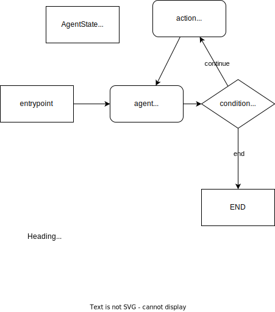

# [LangGraph](https://python.langchain.com/docs/langgraph)

## Overview



**LangGraph** is a library for building stateful, multi-actor applications with LLMs, built on top of (and intended to be used with) LangChain.

!!! When to use LangGraph
    The main use is for adding **cycles** to your LLM application. examples:

    1. if there's an order to execute agents (e.g. get information and then draw a chart)

1. **AgentState**: Defined by `TypedDict` with
1. **StateGraph**:
1. **Node**: Agent (call model) or Tool (call tool). Each node returns operations to update that state. These operations can either SET specific attributes on the state (e.g. overwrite the existing values) or ADD to the existing attribute.
1. **Edge**:
    1. A conditional edge can be defined by `add_conditional_edge`
    1. An edge can be defined by `add_edge`

## Getting Started

1. Create a tool and `ToolExecutor`

    ```py
    from langgraph.prebuilt import ToolExecutor
    tool_executor = ToolExecutor(tools)
    ```

1. Set up a model and bind tools

    ```py
    model = ChatOpenAI(temperature=0, streaming=True)

    from langchain.tools.render import format_tool_to_openai_function

    functions = [format_tool_to_openai_function(t) for t in tools]
    model = model.bind_functions(functions)
    ```

1. Define `AgentState`

    ```py
    from typing import TypedDict, Annotated, Sequence
    import operator
    from langchain_core.messages import BaseMessage


    class AgentState(TypedDict):
        messages: Annotated[Sequence[BaseMessage], operator.add]
    ```

1. Define node

    !!! note
        node returns `{"messages": [response]}`, which is used to update `AgentState`.

    1. Agent: `call_model`

        ```py
        def call_model(state):
            messages = state["messages"]
            response = model.invoke(messages)
            # We return a list, because this will get added to the existing list
            return {"messages": [response]}
        ```

    1. Tool `action`: `call_tool`

        ```py
        def call_tool(state):
            ...
            action = ToolInvocation(
                tool=last_message.additional_kwargs["function_call"]["name"],
                tool_input=json.loads(last_message.additional_kwargs["function_call"]["arguments"]),
            )
            response = tool_executor.invoke(action)
            function_message = FunctionMessage(content=str(response), name=action.tool)
            return {"messages": [function_message]}
        ```

1. Define graph
    1. Create workflow

        ```py
        workflow = StateGraph(AgentState)
        ```

    1. Add nodes

        ```py
        workflow.add_node("agent", call_model)
        workflow.add_node("action", call_tool)
        ```

    1. Add entrypoint

        ```py
        workflow.set_entry_point("agent")
        ```

    1. Add Edge

        ```py
        workflow.add_conditional_edges("agent", should_continue, { "continue": "action", "end": END} # conditional edge
        workflow.add_edge("action", "agent") # normal edge
        ```

    1. Compile

        ```py
        app = workflow.compile()
        ```

1. Use it.

    ```py
    inputs = {"messages": [HumanMessage(content="what is the weather in sf")]}
    print(app.invoke(inputs))
    ```

1. Run

    ```
    poetry run python src/examples/langgraph_sample.py
    ```

    <details>

    `{'messages': [HumanMessage(content='what is the weather in sf'), AIMessage(content='', additional_kwargs={'function_call': {'arguments': '{\n  "__arg1": "weather in San Francisco"\n}', 'name': 'google-search'}}), FunctionMessage(content="[{'title': '10-Day Weather Forecast for San Francisco, CA - The Weather ...', 'link': 'https://weather.com/weather/tenday/l/San+Francisco+CA+USCA0987:1:US', 'snippet': 'Be prepared with the most accurate 10-day forecast for San Francisco, CA with highs, lows, chance of precipitation from The Weather Channel and Weather.com.'}, {'title': 'San Francisco, CA Weather Forecast | AccuWeather', 'link': 'https://www.accuweather.com/en/us/san-francisco/94103/weather-forecast/347629', 'snippet': 'San Francisco, CA Weather Forecast, with current conditions, wind, air quality, and what to expect for the next 3 days.'}, {'title': '10-Day Weather Forecast for Inverness, CA - The Weather Channel ...', 'link': 'https://weather.com/weather/tenday/l/Inverness+CA?canonicalCityId=61b2ebcaa5e78eebca92d21eaff7a0439eb081e8e60287fca37af4186f8242b7', 'snippet': 'Sun 11 | Night. 40°. 9%. NE 6 mph. Partly cloudy early followed by cloudy skies overnight. Low near 40F. Winds NE at 5 to 10 mph. Humidity97%.'}, {'title': 'San Francisco, CA Weather Conditions | Weather Underground', 'link': 'https://www.wunderground.com/weather/us/ca/san-francisco', 'snippet': 'San Francisco Weather Forecasts. Weather Underground provides local & long-range weather forecasts, weatherreports, maps & tropical weather conditions for\\xa0...'}, {'title': 'Hourly Weather Forecast for San Francisco, CA - The Weather ...', 'link': 'https://weather.com/weather/hourbyhour/l/54f9d8baac32496f6b5497b4bf7a277c3e2e6cc5625de69680e6169e7e38e9a8', 'snippet': 'Hourly Local Weather Forecast, weather conditions, precipitation, dew point, humidity, wind from Weather.com and The Weather Channel.'}]", name='google-search'), AIMessage(content="The weather in San Francisco can vary, but you can check the 10-day weather forecast on The Weather Channel's website [here](https://weather.com/weather/tenday/l/San+Francisco+CA+USCA0987:1:US). You can also find the current weather conditions and forecast on AccuWeather's website [here](https://www.accuweather.com/en/us/san-francisco/94103/weather-forecast/347629).")]}`

    </details>

## Examples

### [Basic Multi-agent Collaboration](https://github.com/langchain-ai/langgraph/blob/main/examples/multi_agent/multi-agent-collaboration.ipynb)


!!! notes

    Route next action based on the output of the agent `Chart Generator` <-> `Researcher`

    Instead of using `PythonREPL` and `TavilySearchResults` as tools of a single agent, we use a separate agent for each tool and control the next action with conditional edges.

    Inspired by https://github.com/microsoft/autogen

    [AutoGen: Enabling Next-Gen LLM Applications via Multi-Agent Conversation](https://arxiv.org/pdf/2308.08155.pdf)

1. Nodes:
    1. Agent `Chart Generator` (tool: `PythonREPL`): Call LLM to get the arguments.
    1. Agent `Researcher` (tool: `TavilySearchResults`): Call LLM to get the arguments.
    1. Tool `call_tool`: invoke the tool specified in the last message
1. Edges: Conditional Edge
    1. `router`
        1. last_message.additional_kwargs contains `function_call` ->`call_tool`
        1. `FINAL_ANSWER` -> `end`
        1. Otherwise, `continue`
    1. `Researcher` -> `{"continue": "Chart Generator", "call_tool": "call_tool", "end": END}`
    1. `Chart Generator` -> `{"continue": "Researcher", "call_tool": "call_tool", "end": END}`

### [Agent Supervisor](https://github.com/langchain-ai/langgraph/blob/main/examples/multi_agent/agent_supervisor.ipynb)


!!! notes

    Let LLM to decide which agent to use.

    We consider it as 'agent as a tool'. This example is pretty similar to normal Agent with Tools.

    - Supervisor agent <-> Agent
    - Member agents <-> Tools

### [Hierarchical Agent Teams](https://github.com/langchain-ai/langgraph/blob/main/examples/multi_agent/hierarchical_agent_teams.ipynb)


!!! notes

    Advanced version of Agent supuervisor with multiple layers of group of agents.

    - Supervisor
    - Teams
    - Agents

    Inspired by https://github.com/microsoft/autogen

    [AutoGen: Enabling Next-Gen LLM Applications via Multi-Agent Conversation](https://arxiv.org/pdf/2308.08155.pdf)

## Sample Codes

```
poetry run python src/examples/langgraph_sample.py
```

```py title="langgraph_sample.py"
--8<-- "src/examples/langgraph_sample.py"
```
