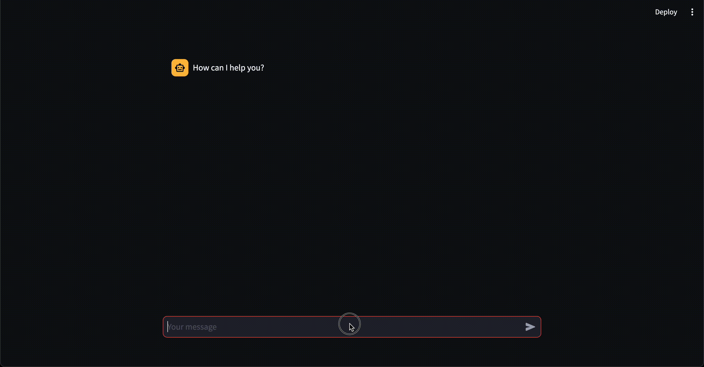

# streamlit

## basic chat app with memory



```py
# https://python.langchain.com/docs/integrations/memory/streamlit_chat_message_history

from langchain_community.chat_message_histories import (
    StreamlitChatMessageHistory,
)
from langchain_core.prompts import ChatPromptTemplate, MessagesPlaceholder
from langchain_core.runnables.history import RunnableWithMessageHistory
from langchain_openai import ChatOpenAI
import streamlit as st


msgs = StreamlitChatMessageHistory(key="langchain_messages")

if len(msgs.messages) == 0:
    msgs.add_ai_message("How can I help you?")

prompt = ChatPromptTemplate.from_messages(
    [
        ("system", "You are an AI chatbot having a conversation with a human."),
        MessagesPlaceholder(variable_name="history"),
        ("human", "{question}"),
    ]
)

chain = prompt | ChatOpenAI()
chain_with_history = RunnableWithMessageHistory(
    chain,
    lambda session_id: msgs,  # Always return the instance created earlier
    input_messages_key="question",
    history_messages_key="history",
)

for msg in msgs.messages:
    st.chat_message(msg.type).write(msg.content)

if prompt := st.chat_input():
    st.chat_message("human").write(prompt)

    # As usual, new messages are added to StreamlitChatMessageHistory when the Chain is called.
    config = {"configurable": {"session_id": "any"}}
    response = chain_with_history.invoke({"question": prompt}, config)
    st.chat_message("ai").write(response.content)
```

```
poetry run streamlit run src/projects/apps/streamlit/chat_with_history.py
```

!!! note
    `langchain_community` had a [bug](https://github.com/langchain-ai/langchain/issues/18684) that was fixed in [this PR](https://github.com/langchain-ai/langchain/pull/18834).
    I confirmed it works with the latest version of `langchain_community` (0.0.28).

- https://python.langchain.com/docs/integrations/memory/streamlit_chat_message_history
- https://github.com/streamlit/streamlit/issues/7290

## Ref

1. [社員1000人以上が使う、Streamlit in Google Cloudのサーバレスプラットフォームを完全内製してみた](https://nttdocomo-developers.jp/entry/20231212_2)
