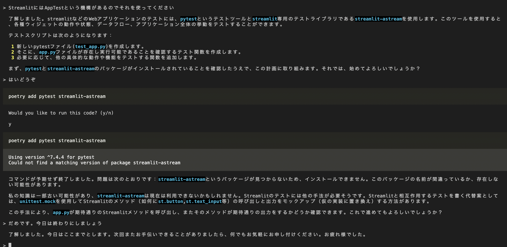

# [Open Interpreter](https://github.com/KillianLucas/open-interpreter)

```
poetry add open-interpreter
```

```
interpreter
```

tried to develop streamlit app but it's not that easy to create a web app with streamlit.



## Ref

1. https://github.com/karaage0703/open-interpreter-docker
1. https://qiita.com/ot12/items/d2672144b914cb6f252f
